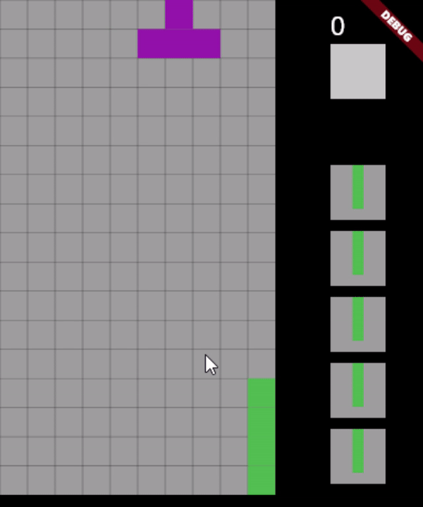

# demo Tetris

A simple demo on how to create tetris-game can be implemented using Flutter and Flame

## Game rules:

Winning Condition: Reached the end of player's life
Losing condition: Unable to spawn more block

Mechanism:
- press Q/E to rotate clockwise/anti
- press P to swap with stored block
- press A/D to move left/right
- press Space to speed up all the way down
- press S to speed up by 1 block

# Packages:
- Flame
- window_manager
